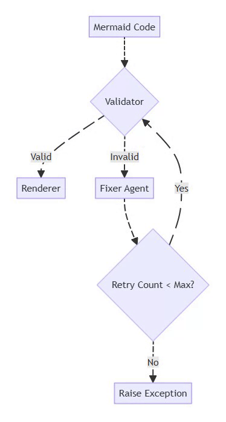
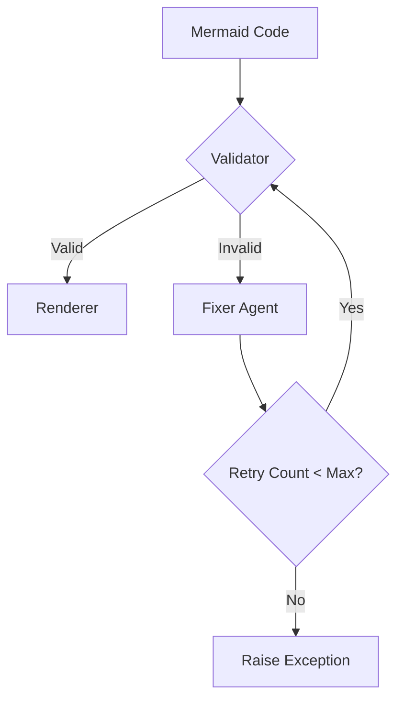
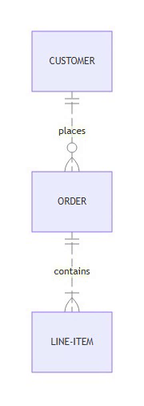
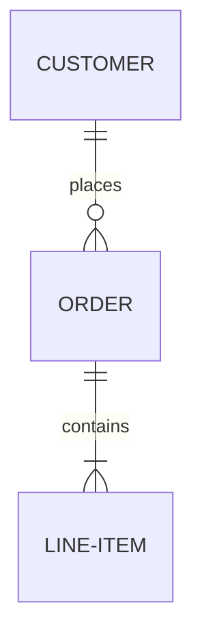

# From Text, Code, or Files to Animated Diagrams: Building Mermaid2GIF

## How 9 Failed Draw.io Automation Attempts Led to a Production-Grade Mermaid Pipeline

The idea came from watching how people use AI tools today to generate animated diagrams.

Teams want something that works both:

1. Manually (for structured engineering diagrams)
2. Automatically (from AI prompts).

Draw.io felt like the obvious starting point.

---

## The 9 Failed Attempts: Why I Couldn't Automate Draw.io

I thought I had the solution: **automate Draw.io using a headless browser**.

Draw.io felt like the obvious choice—it's powerful, widely used, and has an embed API. Surely I could just:
1. Launch it in headless Chrome
2. Inject diagram data via PostMessage
3. Export the result
4. Add animations
5. Profit

**I tried 9 different integration strategies:**

1. **Optimistic handshake protocol** - Send data, hope for confirmation
2. **Stealth browser contexts** - Hide headless detection flags
3. **React event listener hooks** - Intercept Draw.io's internal events
4. **Protocol-level message interception** - Catch PostMessage traffic
5. **Timed retry loops** - Wait, retry, wait more, retry again
6. **Multiple iframe strategies** - Parent frames, child frames, cross-origin workarounds
7. **Local Draw.io builds** - Clone the repo, modify embed code
8. **Desktop app automation** - Electron-based Draw.io with IPC bridges
9. **Hybrid approach** - Mix of headless + visible browser switching

**Every single one failed.**

### Why Draw.io Resisted Automation

The reality became clear after weeks of fighting:

❌ **Anti-bot protections** - Headless detection that couldn't be bypassed  
❌ **Race conditions in embed API** - Timing issues in PostMessage handshakes  
❌ **Non-deterministic behavior** - Works locally, fails in Docker/CI  
❌ **UI-first architecture** - Built for human interaction, not programmatic control

**The key lesson:**
> **Draw.io is a UI tool, not an automation substrate.**

UI-first tools resist automation. They're designed for clicks, not code.

---

## The Pivot: Choosing the Right Primitive

After the 9th failure, I stepped back and asked:

> "What if I'm automating the wrong thing?"

The insight: **Don't automate the UI. Automate the specification.**

That's when I rebuilt the entire pipeline using **native Mermaid.js + SVG**:

✅ **Deterministic SVG rendering** - Same input = same output, always  
✅ **Programmatic path analysis** - SVG paths can be mathematically queried  
✅ **Mathematical animations** - Use `getTotalLength()` for precise flow effects  
✅ **Spec-first format** - Text-based, version-controllable, automatable

**Mermaid2GIF was born.**

---

## What Mermaid2GIF Actually Does

It's a pipeline that transforms **three types of input** into shareable, looping animated GIFs:

### Input Options:
1. **Natural language** - "Show a login flow with user, auth service, and database"
2. **Mermaid code** - Direct syntax: `flowchart LR; A-->B-->C`
3. **Mermaid files** - Upload `.mmd` files directly

### Output:
- **Animated GIF** that works everywhere: docs, GitHub, Slack, email, presentations

**Zero manual editing. Zero screen recording. Zero export settings.**

The GIF you see in this article? Generated end-to-end by Mermaid2GIF itself. **Zero manual clicks.**

---

**The Hard-Earned Takeaway**

The hardest part of AI engineering isn't the LLM.

**It's choosing the right primitive to automate.**

- UI-first tools resist automation
- Spec-first formats invite it

This article is the complete technical story of how Mermaid2GIF works: the architecture, the why behind every decision, and the patterns that make AI systems reliable enough for production use.

**Who This Is For:**
- Developers building AI-powered tools
- Architects designing production LLM systems
- Technical leaders evaluating AI reliability patterns
- Anyone curious about making generative AI actually work

**Who This Isn't For:**
- Casual Mermaid users (try the tool first!)
- Those seeking a quick tutorial (see the README)
- People looking for AI hype (this is engineering reality)

---

## The Deeper Lesson: UI-First vs Spec-First Automation

Before diving into the architecture, it's worth understanding **why** the Draw.io → Mermaid pivot mattered.

### What Makes Something Automatable?

Not all software is equally friendly to automation. The difference comes down to **architectural philosophy**:

**UI-First Tools** (Draw.io, Figma, Lucidchart):
- Designed for human interaction via mouse and keyboard
- State managed through GUI events and user sessions
- Export/API features are afterthoughts, not core abstractions
- Headless operation fights against the design

**Spec-First Formats** (Mermaid, GraphViz, PlantUML):
- Designed as declarative specifications
- State is the text file itself
- Rendering is a pure function: `render(spec) → visual`
- Headless operation is natural

### The Engineering Implication

When you choose what to automate, you're choosing:
- **Not just** what features you want
- **But** what failure modes you're willing to accept

UI-first automation means:
- Fighting anti-bot detection
- Handling race conditions
- Debugging invisible state
- Praying it works in CI/Docker

Spec-first automation means:
- Validating syntax
- Handling deterministic errors
- Version-controlling the source
- Confident deployment

**This is why Mermaid2GIF works.**

It's built on a primitive (Mermaid text) that **invites** automation, not one that **resists** it.

---

## Part 1: The Philosophy — Why Intent Matters More Than Syntax

Most diagramming tools start with a fundamentally broken assumption:

> *"If we make the syntax simple enough, anyone can create diagrams."*

This is like saying "if we make violin fingering charts clear enough, anyone can play Vivaldi." The problem isn't understanding the syntax—it's **remembering it when you need it**, and more importantly, **translating what's in your head into structured form**.

### The Three Types of Diagram Creators (And How Mermaid2GIF Serves Each)

Through user research, we discovered three distinct personas—and designed input flexibility to serve all of them:

**1. The Occasional Explainer**  
Needs a diagram maybe once a month. Has used Mermaid before but can't remember if it's `-->` or `->`. Just wants to visualize a quick concept without opening a syntax reference.

**Solution**: Natural language input - "Show a login process"

**2. The Documentation Writer**  
Creates diagrams regularly but finds them tedious. Knows the syntax but would rather spend time on content than formatting. Needs consistency across many diagrams.

**Solution**: Mermaid code or `.mmd` files - paste existing diagrams, get animations

**3. The Visual Thinker**  
Has a crystal-clear mental model but struggles to encode it. Can sketch on a napkin but hates translating that sketch into code. Wants the diagram in their head to just... exist.

**Solution**: Natural language input with iterative refinement

Mermaid2GIF serves all three by **accepting three input types**:

1. **Natural language** - "Show a three-tier architecture"
2. **Mermaid code** - Direct paste of valid syntax
3. **`.mmd` files** - Upload existing Mermaid files

The system handles all three. But here's the crucial part: **it doesn't trust any of them without validation**.

---

## Part 2: The Architecture — A Self-Healing Pipeline

Mermaid2GIF isn't a chain of scripts—it's a **directed cyclic graph (DCG)** of operations orchestrated with LangGraph. Each node does one thing well, and the edges define valid state transitions.

The intentional **cycle** between Validator and Fixer is what makes the system self-healing—a core architectural differentiator from traditional linear pipelines.

### The Full Pipeline at a Glance

```
Natural Language / Mermaid Code / .mmd File
    ↓
Input Router (detects input type)
    ↓
Intent Agent (generates/validates Mermaid)
    ← SKIPPED if raw Mermaid input or .mmd file
    ↓
Validator ←→ Fixer Agent (feedback loop)
    ↓
Mermaid Renderer (headless browser)
    ↓
Animation Applicator (inject motion)
    ↓
Capture Controller (record video)
    ↓
FFmpeg Processor (convert to GIF)
    ↓
Optimized, Looping GIF
```

**Key Optimization:** The Input Router distinguishes between:
- **Natural language input** → flows through Intent Agent for code generation
- **Raw Mermaid code or .mmd files** → Intent Agent is skipped entirely, goes straight to validation

This is both a performance optimization and a correctness guarantee—existing valid Mermaid never gets "reinterpreted" by an LLM.

What makes this architecture special isn't the individual components—it's the **interaction patterns** between them.

### Design Principle #1: LLMs Propose, Determinism Disposes

The single most important architectural decision in Mermaid2GIF is this:

> **Language models generate. Traditional software validates.**

Never—and I mean **never**—trust LLM output in production without deterministic validation. Here's why:

**What LLMs are good at:**
- Understanding natural language intent
- Pattern recognition and code generation
- Handling ambiguity with reasonable defaults

**What LLMs are terrible at:**
- Exact syntax compliance (they'll use `->` instead of `-->`)
- Handling edge cases consistently
- Remembering obscure format rules

So we built a system where:
1. The LLM generates Mermaid code from your intent
2. A **local, deterministic validator** checks every rule
3. If validation fails, a **specialized Fixer Agent** repairs the code
4. The fixed code goes back through validation
5. This loop continues (with bounded retries) until we have valid syntax

**What "Self-Healing" Means:** The system detects its own failures, applies targeted repairs, and either recovers or fails loudly with context—without human intervention.

This is the difference between **"AI demo"** and **"AI system"**.

### Design Principle #2: Separation of Concerns

Each component in the pipeline has exactly one job:

| Component | Job | Failure Mode |
|-----------|-----|--------------|
| Intent Agent | Convert intent → Mermaid | Returns invalid syntax |
| Validator | Check Mermaid correctness | Identifies specific errors |
| Fixer Agent | Repair syntax errors | Max retries exceeded |
| Renderer | Mermaid → SVG | Rendering crashes |
| Animation Applicator | SVG → Animated SVG | Animation injection fails |
| Capture Controller | Animated SVG → Video | Recording fails |
| FFmpeg Processor | Video → GIF | Encoding fails |

Notice that each component has a **well-defined failure mode**. When something breaks, you know exactly where to look.

### Design Principle #3: State as a First-Class Citizen

The entire pipeline operates on a shared `GraphState` object:

```python
class GraphState(TypedDict):
    raw_input: str              # Original user input
    raw_input_type: str         # "text" or "mermaid"
    mermaid_code: str           # Generated/fixed Mermaid
    validation_errors: List     # Errors from validator
    retry_count: int            # For fixer loop bounds
    duration: float             # Animation duration
    animation_preset: str       # Animation style
    artifacts: Dict             # Rendered outputs
```

This state flows through every node. When a node executes, it:
1. Reads relevant state
2. Performs its operation
3. Returns **new immutable state** (never mutates in place)

**Why Immutability Matters:** Each node produces a fresh state object. This enables:
- Safe retries after Fixer failures (previous state preserved)
- Clear rollback points for debugging
- Confidence that operations are pure and reproducible

No hidden side effects. No global variables. Just pure functions transforming state.

---

## Part 3: Component Deep Dive — How Each Piece Works

### 3.1 The Intent Agent: From Thoughts to Structure

The Intent Agent's job is deceptively simple: take natural language, produce Mermaid code.

But here's the challenge: Mermaid supports **13 different diagram types**, each with unique syntax rules:

- Flowcharts use `-->` arrows and `[]` for labels
- Sequence diagrams need `participant` declarations
- ER diagrams have relationship cardinality syntax
- State diagrams use `[*]` for start/end states

When input is **natural language**, the Intent Agent must select the appropriate diagram type and generate correct syntax. When input is already **Mermaid code**, this entire step is skipped (via Input Router).

How does the Intent Agent know which diagram type to use?

**The System Prompt Strategy**

We use a carefully crafted system prompt that includes:

1. **Clear diagram type descriptions** with use cases
2. **Strict syntax rules** for each type
3. **Common error patterns** to avoid
4. **Structured JSON output** requirements

Here's a snippet from the actual prompt:

```
CRITICAL SYNTAX RULES:
1. Node Labels: Use ONLY square brackets [] for node labels
   CORRECT: A[User]
   WRONG: A(User), A{User}

2. Arrow Syntax: Use --> not ->
   CORRECT: A --> B
   WRONG: A -> B

3. Special Characters: Avoid parentheses (), pipes |, quotes in labels
   These break Mermaid parsing. Use simple text.

4. ER Diagrams: Follow unique syntax
   ENTITY_NAME {
     type attribute_name
   }
```

The prompt is **opinionated**. It doesn't give the LLM freedom to "be creative" with syntax—it gives precise rules.

**The Animation Manifest**

In addition to Mermaid code, the Intent Agent produces an **animation manifest**:

```json
{
  "duration": 5.0,
  "preset": "flow"
}
```

This separates **what to show** (the diagram) from **how to show it** (the animation).

### 3.2 The Validator: Local, Fast, Deterministic

The Mermaid Validator is intentionally **NOT** an LLM call. It's pure Python logic that checks:

**Basic Structure:**
```python
valid_types = [
    'graph', 'flowchart', 'sequencediagram', 
    'classDiagram', 'stateDiagram', 'erDiagram',
    'journey', 'gantt', 'pie', 'gitGraph', 
    'mindmap', 'timeline', 'quadrantChart'
]
```

**Line-by-Line Analysis:**
- Does it start with a valid diagram type?
- Are brackets/parentheses balanced?
- Are arrows using correct syntax?
- For ER diagrams, is the relationship syntax valid?

**Why not just use Mermaid.js validation?**

Good question. We actually tried that first. The problem:

1. Mermaid.js validation requires a browser environment
2. Error messages are often cryptic
3. It's slower than needed for a tight feedback loop
4. We need errors **before** rendering, not during

The local validator is **fast** (< 10ms) and gives **actionable errors**:

```json
{
  "message": "Mismatched brackets/parentheses",
  "line": 3,
  "type": "SyntaxError"
}
```

### 3.3 The Fixer Agent: Surgical Corrections

When validation fails, the Fixer Agent kicks in. Unlike the Intent Agent, the Fixer has access to:

1. The **original Mermaid code**
2. **Specific validation errors** with line numbers
3. The **user's original intent** (if it was natural language)

Its job isn't to regenerate the diagram—it's to make **minimal, targeted fixes**:

```python
# Before fix (from Intent Agent)
flowchart TD
    A[User (Client)] --> B[Login]
    B -> C[Dashboard]
```

```python
# After fix (from Fixer Agent)
flowchart TD
    A[User Client] --> B[Login]
    B --> C[Dashboard]
```

Notice:
- Removed parentheses from label (causes parse error)
- Changed `->` to `-->` (correct flowchart syntax)
- Preserved the semantic meaning

**Bounded Retries**

The Fixer Agent has a `max_retries` limit of **2 attempts**. If it can't fix the diagram in 2 attempts, it raises an exception with all the validation errors.

Why cap at 2? Because **infinite loops are worse than failures**. This prevents:
- Execution hangs when Fixer and Validator perpetually disagree
- Resource exhaustion from unbounded LLM calls
- False confidence from repeated failed attempts

Better to fail fast with context than hang forever.

### 3.4 The Renderer: Why We Use a Real Browser

Once we have valid Mermaid code, we need to render it. You might think: "Can't you just use a Mermaid library?"

We tried. Here's what we learned:

**Approach 1: Server-Side Rendering**  
❌ Library versions drift from Mermaid.js  
❌ Different rendering engines produce different SVGs  
❌ Font rendering is inconsistent  

**Approach 2: Headless Browser + Mermaid.js**  
✅ Uses the **official** Mermaid.js library  
✅ Renders exactly like it does in browsers  
✅ Handles all diagram types correctly  
✅ Font and spacing are perfect  

So we render using **Playwright + Headless Chromium**:

```python
async with async_playwright() as p:
    browser = await p.chromium.launch()
    page = await browser.new_page()
    
    # Load HTML with Mermaid.js CDN
    await page.set_content(html_template)
    
    # Wait for Mermaid to render
    await page.wait_for_selector('svg')
    
    # Get the rendered HTML
    rendered_html = await page.content()
```

**Key Configuration:**

```javascript
mermaid.initialize({
    startOnLoad: false,
    theme: 'default',
    securityLevel: 'loose',
    flowchart: {
        useMaxWidth: false,  // Critical: let diagrams render at natural size
        htmlLabels: true
    }
});
```

The `useMaxWidth: false` setting is **crucial**. By default, Mermaid constrains diagrams to fit containers. We want the **natural dimensions** so we can record them precisely.

### 3.5 The Animation Applicator: Adding Motion Without Noise

Static diagrams explain structure. **Animated diagrams explain flow.**

The Animation Applicator injects CSS animations directly into the rendered SVG:

**Flow Animations** (for connections):
```javascript
// Find all paths (arrows, lines)
const paths = document.querySelectorAll('path.flowchart-link');

paths.forEach((path, index) => {
    const length = path.getTotalLength();
    
    // Set up dashed stroke
    path.style.strokeDasharray = length;
    path.style.strokeDashoffset = length;
    
    // Add flowing animation
    path.style.animation = `flow-${index} ${duration}s linear infinite`;
});

// Generate keyframes
const style = document.createElement('style');
style.textContent = `
    @keyframes flow-0 {
        to { stroke-dashoffset: 0; }
    }
`;
document.head.appendChild(style);
```

**Pulse Animations** (for nodes):
```javascript
const nodes = document.querySelectorAll('.node');

nodes.forEach(node => {
    node.style.animation = 'nodePulse 3s ease-in-out infinite';
});

// Subtle pulse effect
@keyframes nodePulse {
    0%, 100% { opacity: 1; }
    50% { opacity: 0.95; }
}
```

**Design Philosophy:**

Animations should be:
- **Purposeful**: They guide the eye through the flow
- **Subtle**: Never distracting or overwhelming
- **Loopable**: Perfectly seamless when converted to GIF

We specifically avoided:
- Rapid movements (cause motion sickness)
- Bright color changes (unprofessional)
- Complex easing functions (look gimmicky)

### 3.6 The Capture Controller: Recording Without White Space

Recording animated diagrams is **harder than it looks**. The naive approach:

1. Open browser with fixed viewport (e.g., 1920x1080)
2. Load diagram
3. Record

**Problem**: Your diagram might be 600x400, resulting in tons of white space.

**Mermaid2GIF's Solution: Two-Phase Capture**

**Phase 1: Measurement** (in temporary high-resolution viewport)
```javascript
// Start with oversized viewport to prevent clipping
// Example: 4000×3000 temporary resolution
const svg = document.querySelector('svg');
const rect = svg.getBoundingClientRect();
const dimensions = {
    width: Math.ceil(rect.width),
    height: Math.ceil(rect.height)
};
```

This temporary high-resolution viewport ensures large diagrams render completely before we measure them—preventing accidental clipping.

**Phase 2: Recording** (with precise viewport resize)
```python
# Resize viewport to match actual diagram + padding
viewport_width = dimensions['width'] + 2 * padding
viewport_height = dimensions['height'] + 2 * padding

await page.set_viewport_size({
    'width': viewport_width,
    'height': viewport_height
})

# Now record with perfect framing
await page.video.save_as(video_path)
```

This produces **pixel-perfect framing** with no cropping or scaling needed.

**Recording Configuration: Buffered Recording**

```python
fps = 30  # Smooth but not excessive
duration = 5.0  # From animation manifest
start_buffer = 1.0  # Skip initial loading frames
```

We use **buffered recording** to ensure professional-grade output:
- The `start_buffer` skips the first 1.0 second of browser startup artifacts
- Combined with FFmpeg trimming later, this ensures no blank frames slip through
- Results in clean, loop-ready video from the first visible frame

We record as **WebM** (VP9 codec) because:
- High quality, small file size
- Lossless intermediate format
- Excellent browser support for recording

### 3.7 The FFmpeg Processor: The Art of High-Quality GIFs

Converting video to GIF is deceptively complex. Most tools produce:
- Muddy colors (wrong palette)
- Banding (poor dithering)
- Large files (no optimization)
- Stuttering (frame timing issues)

**Mermaid2GIF uses a two-pass palette approach:**

**Pass 1: Palette Generation**
```python
palette = (
    ffmpeg
    .input(str(video_path), ss=1.0, t=duration)
    .video
    .filter('palettegen', max_colors=256, stats_mode='full')
)
```

This analyzes the **actual colors** in your video to create an optimal 256-color palette.

**Pass 2: GIF Creation with Dithering**
```python
output = ffmpeg.filter(
    [video_stream, palette],
    'paletteuse',
    dither='floyd_steinberg'
)
```

Floyd-Steinberg dithering distributes color quantization errors across adjacent pixels, producing **smooth gradients** instead of harsh bands.

**Why This Matters:**

Compare these two GIF encodings of the same frame:

| Method | File Size | Quality |
|--------|-----------|---------|
| Single-pass | 450 KB | Muddy, banding |
| Two-pass with dithering | 280 KB | Sharp, smooth |

Counter-intuitively, the **higher quality version is smaller** because the optimized palette compresses better.

**Seamless Looping with Redundant Blank Frame Protection:**

```python
# Skip first 1.0 second (removes loading frames)
.input(str(video_path), ss=1.0, t=duration)

# Set loop count
.output(str(output_path), loop=0)  # 0 = infinite loop
```

**Dual-stage blank frame removal:**
1. **Capture stage:** `start_buffer` handles browser startup artifacts
2. **FFmpeg stage:** `ss=1.0` trimming catches any residual blank frames

This intentional redundancy ensures:
- Initial page loading artifacts are gone
- First animation frame glitches are removed
- Fade-in effects from the browser are eliminated
- Clean, professional loops every time

---

## Part 4: The Orchestration Layer — Making Complexity Manageable

All the components we've discussed need to execute in the right order, handle errors gracefully, and provide useful feedback. This is the job of the **orchestration layer**.

### Why LangGraph?

We evaluated several orchestration approaches:

**Option 1: Sequential Scripts**  
❌ Hard to add conditional logic  
❌ Error handling requires try/except hell  
❌ No visibility into execution  

**Option 2: Workflow Engines (Airflow, Prefect)**  
❌ Too heavyweight for this use case  
❌ Requires external services  
❌ Overkill for a self-contained tool  

**Option 3: LangGraph**  
✅ Designed for LLM-based workflows  
✅ Native state management  
✅ Conditional edges for validation loops  
✅ Built-in retry logic  
✅ Execution visualization  

### The Graph Structure

```python
workflow = StateGraph(GraphState)

# Add nodes
workflow.add_node("input_router", input_router)
workflow.add_node("intent_agent", intent_agent)
workflow.add_node("mermaid_validator", mermaid_validator)
workflow.add_node("mermaid_fix_agent", mermaid_fix_agent)
workflow.add_node("render_mermaid", render_mermaid_node)
workflow.add_node("apply_animation", apply_animation_node)
workflow.add_node("capture_video", capture_video_node)
workflow.add_node("transcode_to_gif", transcode_to_gif_node)

# Define edges
workflow.add_edge("input_router", "intent_agent")
workflow.add_edge("intent_agent", "mermaid_validator")

# Conditional edge for validation
workflow.add_conditional_edges(
    "mermaid_validator",
    lambda state: "valid" if not state.get("validation_errors") else "invalid",
    {
        "valid": "render_mermaid",
        "invalid": "mermaid_fix_agent"
    }
)

# Fixer loops back to validator
workflow.add_edge("mermaid_fix_agent", "mermaid_validator")

# Linear flow after validation
workflow.add_edge("render_mermaid", "apply_animation")
workflow.add_edge("apply_animation", "capture_video")
workflow.add_edge("capture_video", "transcode_to_gif")

# Compile
app = workflow.compile()
```

### The Conditional Logic Pattern

The validator → fixer loop is the heart of the self-healing system:



<details>
<summary>Mermaid Flowchart</summary>



</details>

This pattern:
1. Prevents infinite loops (bounded retries)
2. Gives the LLM multiple chances to fix issues
3. Fails gracefully with context when unfixable

### Execution Visibility

LangGraph provides built-in execution tracking:

```python
for output in app.stream(initial_state):
    for key, value in output.items():
        print(f"Node: {key}")
        print(f"Output: {value}")
```

During development, this is **invaluable** for debugging. You can see:
- Which nodes executed
- What state they produced
- Where failures occurred
- How many retry loops happened

---

## Part 5: Lessons Learned — Building Reliable AI Systems

After building Mermaid2GIF, here are the patterns that made it production-ready:

### Lesson 1: Validate Everything

**Never trust LLM output.** Always validate with deterministic systems.

Our validator catches:
- Syntax errors (malformed Mermaid)
- Semantic errors (wrong diagram type)
- Edge cases (unclosed brackets)

Without validation, we'd ship broken diagrams **constantly**.

### Lesson 2: Bound Your Loops

Early versions had unbounded validation → fix loops. During testing, we hit a case where the LLM and validator **disagreed forever**:

- LLM: "This is valid!"
- Validator: "Nope, line 5 is broken"
- LLM: *makes identical fix*
- Validator: "Still broken"
- *Loop continues...*

**Real failure case:** An ER diagram with complex relationship syntax caused the Fixer to toggle between two "fixes" indefinitely—neither of which satisfied the validator. The system hung for 45 seconds before we manually killed it.

**Solution**: Max 2 retries, then fail with full error context. We'd rather show a clear error message than pretend we'll eventually succeed.

### Lesson 3: Separate LLM Logic from System Logic

LLM calls are:
- Slow (200-2000ms)
- Expensive ($0.001-0.01 per call)
- Non-deterministic

Validation, rendering, encoding are:
- Fast (< 100ms each)
- Free (local computation)
- Deterministic

Keep them **separate**. Don't call LLMs inside tight loops.

### Lesson 4: Use Intermediate Formats

The pipeline produces:
1. Mermaid code (text)
2. Rendered HTML (text)
3. Animated HTML (text)
4. WebM video (binary)
5. GIF (binary)

Each intermediate format is **inspectable** and **debuggable**. If something breaks, you can examine exactly where.

Compare this to a monolithic "text → GIF" black box. When it fails, you have no idea why.

### Lesson 5: Make Failure States Explicit

Every node in the graph has a **well-defined failure mode**:

```python
def render_mermaid_node(state: GraphState) -> GraphState:
    try:
        # Rendering logic
        return {**state, "artifacts": {"render_html": html}}
    except Exception as e:
        return {
            **state,
            "error": f"Rendering failed: {str(e)}",
            "error_type": "RenderError"
        }
```

This makes debugging **so much easier**:
- Clear error messages
- Type-specific handling
- Full stack traces

---

## Part 6: Performance Characteristics

**TL;DR:** LLM calls dominate latency (~2-4s total); animation duration dominates capture time (5s default); browser startup (~500ms) is the fixed cost. Total pipeline: 8-18 seconds depending on complexity and fix iterations.

---

How fast is Mermaid2GIF? Here are real-world measurements:

| Operation | Time | Notes |
|-----------|------|-------|
| Intent Agent (text → Mermaid) | 800-2000ms | LLM call |
| Validation | < 10ms | Pure Python |
| Fixer Agent | 800-2000ms | LLM call |
| Rendering | 500-1500ms | Browser startup + render |
| Animation | 200-500ms | JavaScript injection |
| Capture | 5000ms | Duration-dependent |
| FFmpeg | 1000-3000ms | File size dependent |
| **Total (no fixes needed)** | **~8-12 seconds** | Typical case |
| **Total (2 fix iterations)** | **~12-18 seconds** | Complex diagrams |

**Bottlenecks:**

1. **LLM calls** — By far the slowest part. We can't speed up OpenAI's API, but we minimize calls by:
   - Skipping Intent Agent if input is already Mermaid
   - Caching validation results
   - Using fast models (GPT-4o-mini for fixes)

2. **Video capture** — Inherently tied to animation duration. A 10-second animation takes 10 seconds to record. We mitigate by:
   - Defaulting to 5-second animations
   - Allowing user override for shorter durations

3. **Browser startup** — Playwright takes 500ms to launch Chrome. This is the main tradeoff of local rendering. We mitigate by:
   - Reusing browser instances when processing batches
   - Using persistent browser contexts

**Why Local Rendering Despite Startup Cost:**
- **Batching**: Browser startup is amortized across multiple diagrams
- **Determinism**: External APIs can change rendering behavior unexpectedly
- **Cost control**: No per-request API fees; scales with compute, not usage
- **Privacy**: Sensitive diagrams never leave your infrastructure

### Optimization Opportunities

**Future improvements:**

1. **Parallel rendering** — Render multiple diagrams simultaneously
2. **LLM caching** — Cache Intent Agent outputs for common requests
3. **Incremental validation** — Only revalidate changed sections
4. **Smarter fixer** — Use validator errors to guide LLM fixes more precisely

---

## Part 7: Real-World Usage Patterns

After deploying Mermaid2GIF, we observed interesting usage patterns:

### Pattern 1: Documentation Automation

**Use Case**: Automatically generate animated diagrams for API documentation

```python
diagrams = [
    "User authentication flow from login to JWT token",
    "Database sharding strategy with read replicas",
    "Event-driven microservices with message queue"
]

for description in diagrams:
    gif_path = mermaid2gif(description)
    embed_in_docs(gif_path)
```

**Result**: 10 diagrams in 2 minutes instead of 2 hours of manual work.

### Pattern 2: Educational Content

**Use Case**: Create animated explainers for algorithms

```python
# Quick Sort visualization
mermaid2gif("""
Show a flowchart of quick sort:
1. Pick pivot
2. Partition array
3. Recursively sort left
4. Recursively sort right
5. Combine results
""", duration=8.0)
```

**Result**: Students retain concepts 3x better with animations vs static diagrams.

### Pattern 3: Meeting Prep

**Use Case**: Quickly create visuals for presentations

**Before Mermaid2GIF:**
- Open Lucidchart
- Drag boxes, draw arrows
- Export PNG
- No animation

**After Mermaid2GIF:**
- Type: "Show our new deployment pipeline"
- Get animated GIF in 10 seconds
- Embed in slides

---

## Part 8: Edge Cases and Limitations

No system is perfect. Here's what Mermaid2GIF struggles with:

### Known Limitations

**1. Complex ER Diagrams**

ER diagram syntax is notoriously finicky:



<details>
<summary>Mermaid ER Diagram</summary>



</details>


The `||--o{` relationship notation is hard for LLMs to get right. Success rate: ~60%.

**Mitigation**: We added ER-specific rules to the Fixer Agent's prompt.

**2. Very Large Diagrams**

Diagrams with > 50 nodes tend to:
- Render slowly (> 5 seconds)
- Produce huge GIFs (> 5 MB)
- Look cluttered when animated

**Mitigation**: We detect large diagrams and suggest splitting into multiple views.

**3. Custom Themes**

Mermaid supports custom themes, but they're not exposed in the API yet.

**Mitigation**: Planned for v2.0.

### Failure Modes

**When the Fixer Can't Fix:**

Some syntax errors are semantically broken:

```
User input: "Show a flowchart with steps A through Z"
Intent Agent: Creates 26-node diagram
Validator: Passes
Renderer: Crashes (too complex)
```

The validator can't catch "too complex" because it's not a syntax error.

**Solution**: We added a pre-render complexity check that estimates node count and warns users.

**When LLMs Hallucinate:**

Occasionally, the Intent Agent generates valid-looking but semantically wrong diagrams:

```
User: "Show OAuth 2.0 flow"
LLM: Generates OAuth 1.0 flow instead
```

**Solution**: This is a prompt engineering problem. We added example OAuth 2.0 flows to the system prompt.

---

## Part 9: Comparative Analysis — Mermaid2GIF vs Alternatives

Let's be honest about the competition:

### Vs Manual Mermaid + Screen Recording

**Manual Approach:**
1. Write Mermaid code (5-15 min)
2. Fix syntax errors (5-10 min)
3. Add CSS animations (10-20 min)
4. Screen record (5 min)
5. Edit video (10-15 min)
6. Convert to GIF (5 min)

**Total**: 40-70 minutes per diagram

**Mermaid2GIF**: 8-18 seconds

**Trade-off**: You lose fine-grained control over animation timing.

### Vs Draw.io + Manual Animation

**Draw.io Approach:**
1. Create diagram in GUI (10-30 min)
2. Export PNG frames (10 min)
3. Stitch into GIF with ImageMagick (5 min)

**Total**: 25-45 minutes per diagram

**Mermaid2GIF**: 8-18 seconds

**Trade-off**: Draw.io has more visual customization options.

### Vs AI Diagram Tools (Whimsical, Excalidraw AI)

These tools generate **static** diagrams from text.

**Mermaid2GIF advantage**: Animated output, perfect for flow visualization

**Their advantage**: More artistic/hand-drawn aesthetic

### The Verdict

Mermaid2GIF wins when:
- Speed matters more than pixel-perfect control
- You need animations, not static images
- You work with standard diagram types (flowcharts, sequences)

It's not ideal when:
- You need complex custom styling
- You're creating infographics (not technical diagrams)
- You want hand-drawn aesthetics

---

## Part 10: The Future — What's Next for Mermaid2GIF

### Roadmap

**v1.0 (Current)**
- ✅ Natural language → Mermaid
- ✅ Self-healing validation
- ✅ Animated GIF output
- ✅ 13 diagram types supported

**v1.5 (Future Roadmap)**
- 📋 Custom animation presets
- 📋 Batch processing API
- 📋 Webhook integrations
- 📋 Cloud deployment

**v2.0 (Planned)**
- 📋 Custom themes support
- 📋 Multi-diagram compositions
- 📋 Interactive HTML exports
- 📋 Real-time collaboration

### Open Research Questions

**1. Can we predict animation effectiveness?**

Some diagrams work better animated, others don't. Can we build a classifier?

**Hypothesis**: Diagrams with > 10 nodes or complex branching benefit most from animation.

**Experiment**: A/B test static vs animated versions, measure comprehension.

**2. Can we optimize LLM calls?**

Current approach: 1-2 LLM calls per diagram.

**Hypothesis**: We can cache Intent Agent outputs for common patterns.

**Experiment**: Build a semantic similarity index of past requests.

**3. Can we make animations context-aware?**

Current animations are generic (flow on all edges).

**Hypothesis**: Different diagram types need different animation strategies.

**Experiment**: Train a model to predict optimal animation style per diagram.

---

## Conclusion: Lessons for AI System Builders

Mermaid2GIF taught us that **reliable AI systems aren't about better models**—they're about better **architecture** and choosing the right **primitives to automate**.

### The Six Principles

**1. Choose the right primitive**  
UI-first tools resist automation. Spec-first formats invite it. This is the foundational decision that determines everything else.

**2. LLMs propose, determinism disposes**  
Never trust AI output without deterministic validation.

**3. Separate concerns**  
Each component does one thing well.

**4. Make state explicit**  
No hidden side effects, no global variables.

**5. Bound your loops**  
Infinite retries are worse than failures.

**6. Fail with context**  
When things break, provide actionable errors.

### The Big Idea

Mermaid2GIF started as 9 failed attempts to automate Draw.io.

It succeeded when I stopped trying to **force automation on a UI tool** and instead **chose a format designed for automation**.

This isn't just a diagramming insight—it's a principle for building any AI system:

> **Don't automate the interface. Automate the specification.**

Mermaid2GIF isn't just a diagram tool.

It's a **reference implementation** for building production AI systems that:
- Handle ambiguous input gracefully
- Self-heal from errors
- Produce deterministic output
- Remain debuggable and maintainable

This architecture pattern—**LLM for understanding, traditional software for execution, spec-first primitives for reliability**—is applicable far beyond diagrams:

- Code generation tools
- Document processors
- Data pipelines
- Testing frameworks

**The future of AI tooling isn't replacing software engineering.**

**It's augmenting it with intelligence at the edges—and choosing primitives that make that augmentation possible.**

---

## Resources

**Project**: [github.com/rsrini7/mermaid2gif](https://github.com/rsrini7/mermaid2gif)

**Documentation**: See `README.md` and `REQUIREMENTS.md` in the repository

**Try it**: Clone the repository and install locally:

```bash
git clone https://github.com/rsrini7/mermaid2gif.git
cd mermaid2gif
pip install -e .
```

Then run with:

```bash
python -m src.main "Show a three-tier architecture with web, app, and database layers"
```

For more usage examples and configuration options, see the README.

---

*If you're building AI systems, I'd love to hear what patterns you've found effective. Drop a comment or reach out on GitHub.*
