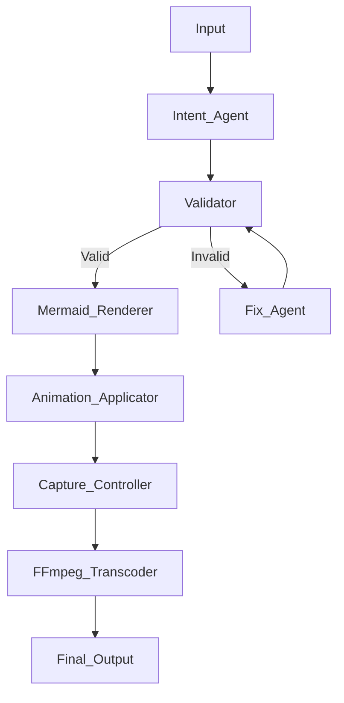

# Mermaid-GIF

**Autonomous Mermaid to Flow-Animated GIF Converter**

[](https://www.python.org/downloads/)
[](https://opensource.org/licenses/MIT)

## Overview

Mermaid-GIF is a fully autonomous, headless system that converts Mermaid diagrams into flow-animated GIFs. The system uses LangGraph for orchestration, LiteLLM for LLM interactions, Playwright for browser automation, and FFmpeg for high-quality media processing.

**Key Features:**
- 🤖 **Fully Autonomous:** Zero manual interaction required
- 🎯 **Headless Execution:** CI/CD safe
- 🔄 **Seamles Loops:** "Buffered Recording" technology eliminates blank frames
- 🎬 **Flow Animation:** Path-based animation that flows correctly along arrows
- 📊 **High Quality:** 1280px HD output with optimized 256-color palettes

## Architecture

The system is implemented as a **Directed Cyclic Graph (DCG)** using LangGraph:



## Technology Stack

- **Orchestration:** LangGraph
- **LLM Interface:** LiteLLM (Groq / OpenRouter)
- **Rendering:** Native Mermaid.js (via Playwright)
- **Animation:** JavaScript Path-Based Calculation
- **Browser Control:** Playwright (Chromium)
- **Media Processing:** FFmpeg (Palette-based encoding)
- **Configuration:** Pydantic Settings

## Installation

### Prerequisites

- Python 3.11+
- FFmpeg (must be in system PATH)

### Setup

1. Clone the repository:
```bash
git clone https://github.com/yourusername/mermaid-gif.git
cd mermaid-gif
```

2. Install dependencies:
```bash
pip install -e .
playwright install chromium
```

3. Configure environment:
```bash
cp .env.example .env
# Edit .env and add either GROQ_API_KEY (Recommended) or OPENROUTER_API_KEY
```

## Usage

### Basic Usage

```bash
# Convert text to GIF
python -m src.main "Create a flowchart showing user authentication flow"
```

### Direct Mermaid Code

```bash
# Convert Mermaid code directly
python -m src.main "graph TD; A[Start] --> B{Check}; B -->|Yes| C[OK];"
```

## Configuration

All configuration is managed through environment variables or `.env` file.

### Credentials (At least one required)

-   `GROQ_API_KEY`: Groq API Key (Recommended for speed/cost). Must start with `gsk_`.
-   `OPENROUTER_API_KEY`: OpenRouter API Key. Must start with `sk-or-`.

### Optional Configuration

| Variable | Default Value | Description |
| :--- | :--- | :--- |
| `LITELLM_MODEL` | `groq/llama-3.3-70b-versatile` | LLM model via LiteLLM |
| `DEFAULT_ANIMATION_DURATION` | `5.0` | Animation duration in seconds |
| `DEFAULT_FPS` | `30` | Frame rate for GIF output |
| `VIEWPORT_WIDTH` | `1920` | Browser viewport width |
| `VIEWPORT_HEIGHT` | `1080` | Browser viewport height |
| `LOG_LEVEL` | `INFO` | Logging level (DEBUG, INFO, WARNING, ERROR) |

## Project Structure

```text
mermaid-gif/
├── src/
│   ├── agents/
│   │   ├── __init__.py
│   │   ├── fixer.py            # Mermaid syntax repair agent
│   │   └── intent.py           # Text-to-Mermaid conversion agent
│   ├── core/
│   │   ├── __init__.py
│   │   ├── config.py           # Pydantic configuration
│   │   ├── exceptions.py       # Custom exception hierarchy
│   │   ├── graph.py            # LangGraph orchestration
│   │   └── state.py            # Shared graph state
│   ├── engine/
│   │   ├── __init__.py
│   │   ├── animation_applicator.py # JS path-based animation
│   │   ├── capture_controller.py   # Playwright video capture
│   │   ├── ffmpeg_processor.py     # FFmpeg transcoding & optimization
│   │   ├── mermaid_renderer.py     # Native Mermaid.js rendering
│   │   ├── mermaid_validator.py    # Syntax validation
│   ├── utils/
│   │   ├── __init__.py
│   │   └── logger.py           # Structured logging
│   ├── __init__.py
│   └── main.py                 # CLI entry point
├── tests/
│   ├── mocks/
│   ├── __init__.py
│   └── test_smoke.py           # Mock-based end-to-end test
├── .env.example
├── Dockerfile
├── pyproject.toml
├── README.md
└── REQUIREMENTS.md
```

## Critical Constraints & Design

1. **No External Dependencies:** Bypassed Draw.io completely. Rendering is pure local Mermaid.js.
2. **Headless Only:** No manual interaction required.
3. **Deterministic:** Same input always produces same output.
4. **Buffered Capture:** Recording time is `Duration + 2s` to ensure clean loops.

## License

MIT License - see LICENSE file for details
