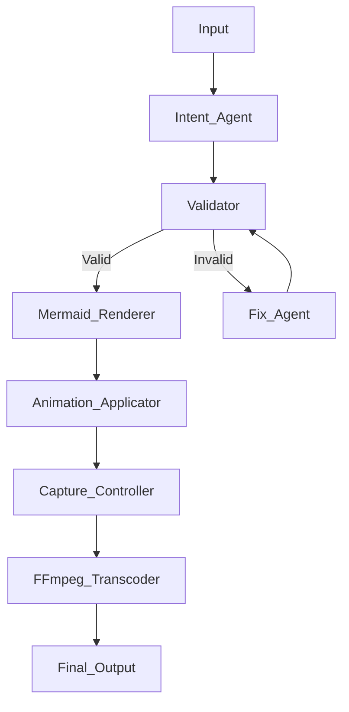

# Mermaid-GIF

**Autonomous Mermaid to Flow-Animated GIF Converter**

[](https://www.python.org/downloads/)
[](https://opensource.org/licenses/MIT)

## Overview

Mermaid-GIF is a fully autonomous, headless system that converts Mermaid diagrams into flow-animated GIFs. The system uses LangGraph for orchestration, LiteLLM for LLM interactions, Playwright for browser automation, and FFmpeg for high-quality media processing.

**Key Features:**
- 🤖 **Fully Autonomous:** Zero manual interaction required
- 🎯 **Headless Execution:** CI/CD safe
- 🔄 **Seamles Loops:** "Buffered Recording" technology eliminates blank frames
- 🎬 **Flow Animation:** Path-based animation that flows correctly along arrows
- 📊 **High Quality:** 1280px HD output with optimized 256-color palettes

## Architecture

The system is implemented as a **Directed Cyclic Graph (DCG)** using LangGraph:



## Technology Stack

- **Orchestration:** LangGraph
- **LLM Interface:** LiteLLM (OpenRouter)
- **Rendering:** Native Mermaid.js (via Playwright)
- **Animation:** JavaScript Path-Based Calculation
- **Browser Control:** Playwright (Chromium)
- **Media Processing:** FFmpeg (Palette-based encoding)
- **Configuration:** Pydantic Settings

## Installation

### Prerequisites

- Python 3.11+
- FFmpeg (must be in system PATH)

### Setup

1. Clone the repository:
```bash
git clone https://github.com/yourusername/mermaid-gif.git
cd mermaid-gif
```

2. Install dependencies:
```bash
pip install -e .
playwright install chromium
```

3. Configure environment:
```bash
cp .env.example .env
# Edit .env and add your OPENROUTER_API_KEY
```

## Usage

### Basic Usage

```bash
# Convert text to GIF
python -m src.main "Create a flowchart showing user authentication flow"
```

### Direct Mermaid Code

```bash
# Convert Mermaid code directly
python -m src.main "graph TD; A[Start] --> B{Check}; B -->|Yes| C[OK];"
```

## Configuration

All configuration is managed through environment variables or `.env` file:

### Required
- `OPENROUTER_API_KEY`: OpenRouter API key

### Optional
- `LITELLM_MODEL`: LLM model identifier (default: `openrouter/anthropic/claude-3.5-sonnet`)
- `DEFAULT_ANIMATION_DURATION`: Animation duration in seconds (default: 5.0)
- `VIEWPORT_WIDTH`: Browser viewport width (default: 1280)
- `LOG_LEVEL`: Logging level (default: INFO)

## Project Structure

```
mermaid-gif/
├── src/
│   ├── agents/                 # LLM-powered agents
│   ├── core/                   # Core system components
│   ├── engine/                 # Deterministic nodes
│   │   ├── mermaid_renderer.py # (impl in drawio_driver.py)
│   │   ├── animation_applicator.py
│   │   ├── capture_controller.py
│   │   └── ffmpeg_processor.py
│   └── utils/
├── tests/
├── Dockerfile
└── .env.example
```

## Critical Constraints & Design

1. **No External Dependencies:** Bypassed Draw.io completely. Rendering is pure local Mermaid.js.
2. **Headless Only:** No manual interaction required.
3. **Deterministic:** Same input always produces same output.
4. **Buffered Capture:** Recording time is `Duration + 2s` to ensure clean loops.

## License

MIT License - see LICENSE file for details
