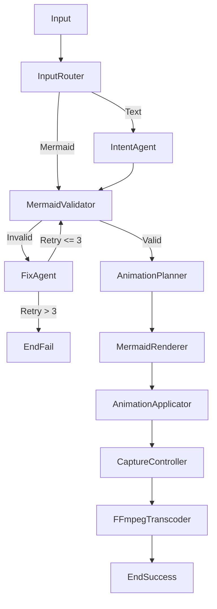

# End-to-End Requirement Document

## Project: **mermaid2gif**

**Version:** **7.0 (Enhanced Quality & Multi-Diagram Support)**
**Status:** **Production Ready**
**Execution Model:** Agentic (LangGraph Directed Cyclic Graph)
**Runtime:** Headless, deterministic, containerized

---

## 0. Implementation Guardrails (MANDATORY PREAMBLE)

These guardrails are **binding** and exist to ensure that AI-generated code is robust, testable, and production-safe.

### Guardrail 1: Secret Management Strategy

* **Tooling:** Configuration **must** be handled using **Pydantic Settings** (`pydantic-settings`).
* **Storage:** Secrets are loaded from environment variables or `.env`.
* **Validation:** Strict type validation is enforced at startup. Failure results in immediate process termination.
* **Constraints:**
* `GROQ_API_KEY`: Required (starts with `gsk_`).
* `OPENROUTER_API_KEY`: Optional fallback.
* `LITELLM_MODEL`: Configurable (default: `groq/llama-3.3-70b-versatile`).


### Guardrail 2: Mock-First Testing Requirement

* **Mandatory Mocks:** LiteLLM client, Playwright browser/page/context.
* **Rule:** The default `test_smoke.py` must run the entire LangGraph workflow using **ONLY mocks**. No real API calls or browser launches are allowed in the smoke test.

### Guardrail 3: Structured Logging Schema

* All logs must follow this **strict JSON schema**:
```python
{
  "timestamp": "ISO8601",
  "node": "node_name",
  "event": "START | END | ERROR",
  "state_hash": "sha256(serialized_state)",
  "metadata": {}
}

```


* No free-form logging is allowed.

---

## 1. Objective

Build a **fully autonomous system** that converts:

> **Natural language or Mermaid input → CSS-animated Mermaid diagram → clean looping GIF**

The system must:

* Run fully headless (CI-safe)
* Require zero manual interaction
* Produce deterministic output
* **Render diagrams locally** using the Mermaid.js library (No external UI/SaaS dependencies)
* Enforce bounded retries

---

## 2. Architectural Principles (Binding)

1. **LangGraph is mandatory**
Required for bounded retry loops, conditional routing, and state persistence.
2. **Strict separation of concerns**
* LLMs → intent, correction, planning
* Deterministic code → rendering, styling, capture, encoding


3. **No External SaaS Dependencies for Rendering**
* **Forbidden:** Draw.io, Kroki, or external rendering APIs.
* **Required:** Local rendering via `mermaid.min.js` inside Headless Chromium.


4. **CSS-Driven Animation**
* Animation is achieved via CSS injection (`stroke-dashoffset` keyframes), not JavaScript graph mutation.


5. **Looping correctness supersedes visual fidelity**
* A clean looping GIF is more important than animation purity.


---

## 3. System Architecture Overview

The system is implemented as a **Directed Cyclic Graph (DCG)** using LangGraph.



Retries are **node-local and bounded**.

---

## 4. Technology Stack (Final)

| Layer | Technology |
| --- | --- |
| Orchestration | LangGraph |
| LLM Interface | LiteLLM |
| LLM Provider | **Groq (Llama 3.3 70B)** / OpenRouter |
| Rendering Engine | **Mermaid.js (Local/CDN)** |
| Browser Control | Playwright (Python, Chromium) |
| Animation | **CSS3 Keyframes** |
| Media Processing | FFmpeg (`ffmpeg-python`) |
| Config | Pydantic Settings |
| Runtime | Docker (Python 3.11 + Node.js 20) |

---

## 5. Repository Structure (Enforced)

```text
mermaid2gif/
├── config/
│   ├── llm_config.yaml
│   └── animation_presets.json
├── src/
│   ├── agents/
│   │   ├── intent.py
│   │   └── fixer.py
│   ├── core/
│   │   ├── state.py
│   │   ├── graph.py
│   │   ├── config.py
│   │   └── exceptions.py
│   ├── engine/
│   │   ├── mermaid_validator.py
│   │   ├── mermaid_renderer.py     <-- Native Mermaid Rendering
│   │   ├── animation_applicator.py <-- CSS Injection
│   │   ├── capture_controller.py
│   │   └── ffmpeg_processor.py
│   └── utils/
│       └── logger.py
├── tests/
├── Dockerfile
├── pyproject.toml
└── .env.example

```

---

## 6. Canonical LangGraph State

All nodes **must read/write exclusively** through this state.

```python
class GraphState(TypedDict):
    raw_input: str
    raw_input_type: str
    mermaid_code: Optional[str]
    animation_manifest: Optional[Dict[str, Any]]
    validation_errors: Optional[List[Dict[str, Any]]]
    diagram_rendered: bool
    animation_applied: bool
    video_path: Optional[str]
    gif_path: Optional[str]
    errors: List[str]
    artifacts: Dict[str, Any]
    retry_count: int

```

---

## 7. Node Specifications (Final)

### 7.1 Input Router Node

* Determines Mermaid vs text input.
* Deterministic logic only.

### 7.2 Intent & Mermaid Generation Agent

* Converts text → Mermaid.
* **Constraint:** Output must be compatible with standard `mermaid.js` rendering.
* **Model:** Llama 3.3 70B (via Groq) is preferred for JSON/Mermaid generation.

### 7.3 Mermaid Validator Node

* **Purpose:** Validate Mermaid syntax before rendering.
* **Implementation:** Basic syntax validation (diagram type, bracket matching for flowcharts).
* **Special Handling:** Skip bracket matching for multi-line syntax diagrams:
  - `erDiagram` - cardinality symbols use `{` and `}`
  - `classDiagram` - class bodies use multi-line `{ ... }`
  - `stateDiagram` - composite states use multi-line `{ ... }`
* **Output:** Set `state["validation_errors"]` if invalid.
* **Library:** `mermaid-parser-py`.
* Parses Mermaid into structured representation.
* Detects syntax errors before rendering to save cycles.

### 7.4 Mermaid Fix Agent

* Repairs syntax only.
* Max 3 retries.

### 7.5 Animation Planner Node

* Deterministic normalization of animation settings.
* No LLM usage.

### 7.6 Mermaid Renderer Node (**Native**)

* **Strategy:** In-Memory HTML Shell.
* **Logic:**
1. Launch Headless Chromium.
2. Construct in-memory HTML shell containing `mermaid.min.js` (CDN).
3. Execute `mermaid.render(id, code)` via `page.evaluate()`.
4. Capture the resulting SVG HTML.
5. **Output:** Store raw HTML in `state["artifacts"]["render_html"]`.


### 7.7 Animation Applicator Node (**Smart JS Injection**)

* **Strategy:** Dynamic JavaScript Path Calculation.
* **Logic:**
1. Load `render_html`.
2. Execute JavaScript to find all edge paths (`.edgePath path`).
3. For each path, calculate `getTotalLength()` dynamically.
4. Apply dynamic `stroke-dasharray` (15% dash, 5% gap) and specific keyframes.
5. **Output:** Store animated HTML in `state["artifacts"]["animated_html"]`.


### 7.8 Capture Controller Node (**Smart Viewport**)

* **Strategy:** Two-Phase Browser Recording (Measure → Record).
* **Logic:**
1. **Phase 1 - Measurement:**
   - Launch temporary browser context with 4000x3000 viewport (supports wide diagrams).
   - Load `animated_html` and wait for SVG.
   - Execute JavaScript: `svg.getBoundingClientRect()` to get exact dimensions.
   - Close measurement context.
2. **Phase 2 - Recording:**
   - Calculate dimensions: `width = bbox.width + 40px`, `height = bbox.height + 40px`.
   - Ensure even dimensions (FFmpeg requirement): round up to nearest even number.
   - Create browser context with exact viewport size.
   - Inject CSS to center content (`display: flex; justify-content: center; align-items: center`).
   - Start video capture.
   - Wait for `duration` (from manifest) + 2s buffer.
   - Stop capture and save `.webm`.
* **Output:** Store video path in `state["artifacts"]["video_path"]` and `state["video_path"]`.


### 7.9 FFmpeg Transcoder Node

* **Quality Settings (Updated):**
  - **Resolution:** Preserve original (no downscaling)
  - **Palette:** 256 colors, `full` stats mode (better quality)
  - **Dithering:** `floyd_steinberg` (sharp, balanced)
  - **Trimming:** `ss=1.0`, `t=duration` (removes buffer)
* **Output:** Seamlessly looping, high-quality GIF.

### 7.10 Final Output Node

* Validate GIF integrity.
* Attach artifacts.

---

## 8. Node Isolation

* `mermaid-parser-py` must run in a subprocess or isolated thread.
* Node.js startup latency must not block the graph.

---

## 9. Error Handling & Recovery

| Failure | Action |
| --- | --- |
| Mermaid parse error | Loop → Fix Agent |
| Render exception | Terminal Failure |
| Animation missing | Retry Applicator |
| Retry exhausted | Terminal failure |

---

## 10. Deliverables

1. LangGraph `graph.py`
2. **Mermaid Native** Node implementations
3. Pydantic config + `.env.example`
4. Dockerfile (Chromium + Python)
5. Mock-first tests
6. Sample GIF outputs
7. CI-safe smoke test